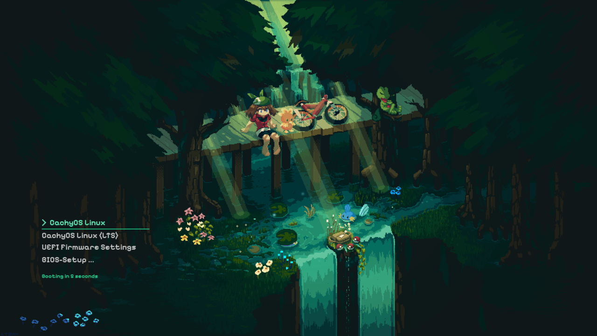

# pixal-grub

A GRUB bootloader theme inspired by the [pixel-emerald](https://github.com/MrxTS/qylock) SDDM lockscreen theme — same background, same font, same color palette.



## Colors

| | Hex | Usage |
|---|---|---|
| Background | `#0b1d1c` | Fallback color |
| Emerald | `#1fce8c` | Selection underline, countdown |
| Mint | `#60e8b6` | Selected menu item |
| Dim white | `#c0c0c0` | Unselected menu items |

Font: **PixelifySans Bold** (from pixel-emerald)

## Requirements

- `ffmpeg`
- `grub-mkfont` (part of `grub`)
- `imagemagick`
- The [pixel-emerald](https://github.com/MrxTS/qylock) theme installed at `~/qylock/`

## Build & Install

```bash
# Generate all assets (background, fonts, sprites)
./build.sh

# Install to /boot/grub/themes/pixel-emerald/
./install.sh

# Activate in /etc/default/grub
# Set: GRUB_THEME="/boot/grub/themes/pixel-emerald/theme.txt"
# Remove or comment out: GRUB_BACKGROUND=...

# Regenerate GRUB config
sudo grub-mkconfig -o /boot/grub/grub.cfg
```

## GRUB Resolution

Tested at `2560x1440`. Make sure your `/etc/default/grub` has:

```
GRUB_GFXMODE="2560x1440,auto"
GRUB_GFXPAYLOAD_LINUX=keep
```

## Troubleshooting

**Blank screen / text only** — remove `GRUB_TERMINAL_OUTPUT=console` from `/etc/default/grub` if present.

**Unknown font** — run `strings /boot/grub/themes/pixel-emerald/pixel-emerald-22.pf2 | head -3` and verify it shows `PixelifySans Bold`.

**Background missing** — verify `GRUB_GFXMODE` is set and `GRUB_BACKGROUND` is not overriding the theme.
